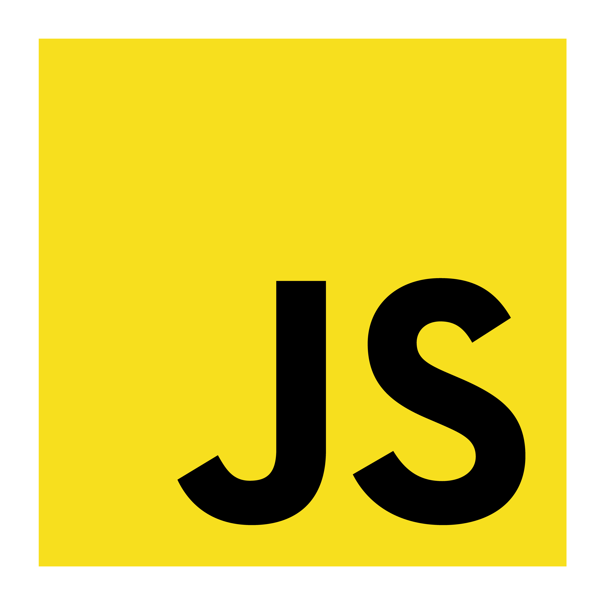

# 
¡Hey! Soy José Manuel.👋

## 
¡Ingeniero Venezolano en Informática! 👨🏻‍💻

# 🏆 Perfil de Github 😄

## 🔨 Lenguajes de programación y tecnologías:

### FrontEnd:
<table>
  <tr>
    <td align="center"> Html</td>
    <td align="center"> Css</td>
    <td align="center"> Tailwind</td>
    <td align="center"> Boostrap</td>
  </tr>
  <tr>
    <td align="center"> Javascript</td>
    <td align="center"> React.js</td>
    <td align="center"> Astro.js</td>
  </tr>
</table>

### Mobile:
<table>
  <tr>
    <td align="center"> React Native</td>
    <td align="center"> Flutter</td>
    <td align="center"> Android</td>
  </tr>
</table>

### DevOps:
<table>
  <tr>
    <td align="center"> Docker</td>
    <td align="center"> PowerShell</td>
    <td align="center"> Gradle</td>
  </tr>
</table>

### Entorno de Trabajo:
<table>
  <tr>
    <td align="center"> Git</td>
    <td align="center"> Github</td>
    <td align="center"> Npm</td>
  </tr>
  <tr>
    <td align="center"> Yarn</td>
    <td align="center"> VSCode</td>
  </tr>
</table>
